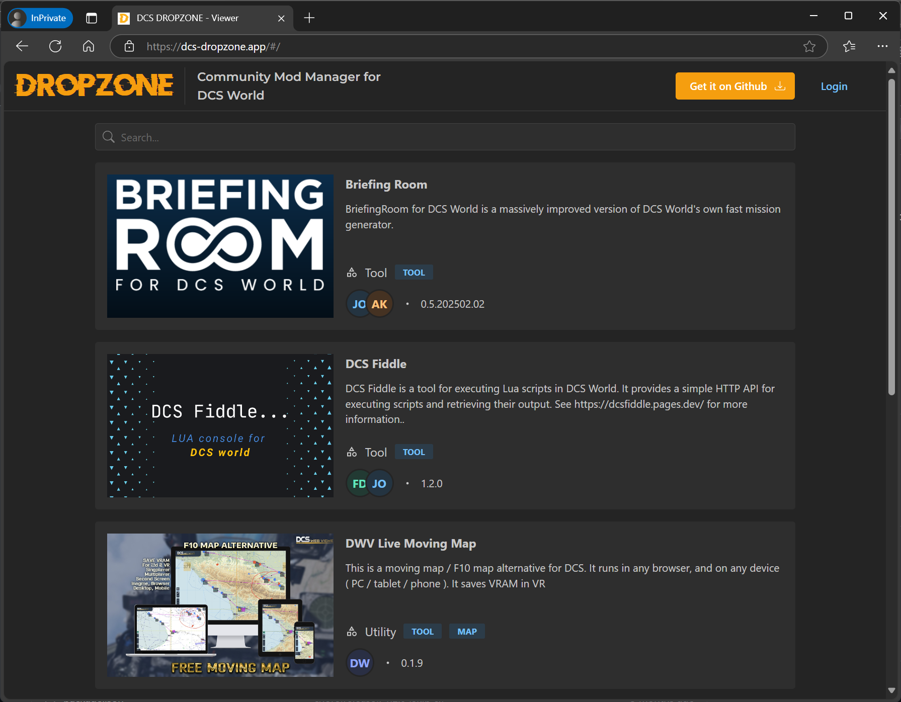

# DCS Dropzone Webapp

https://dcs-dropzone.app/



## Running

You need to have Deno v2.0.0 or later installed to run this repo.

Create a .env file with the following content:

```dotenv
JWT_SECRET=s3cr3t

# GitHub OAuth app credentials, this is only for local development a different Github app exists for production
GH_CLIENT_ID=Ov23li5IVDqsPjGrdLkN
GH_CLIENT_SECRET=4e4ba8824ca0458c02e5fc7b0ebc6232e85b4022

GH_HOMEPAGE_URL=http://localhost:5173/
GH_AUTHORIZATION_CALLBACK_URL=http://localhost:5173/auth/github/callback

# CSV list of github user ids
SUDO_USERS=16135506

CLOUDFLARE_API_TOKEN=DISABLED_FEATURE
CLOUDFLARE_ZONE_ID=DISABLED_FEATURE
ENABLE_CLOUDFLARE_PURGE=false
```

Start a dev server:

```
$ deno task dev
```

## Deploy

Build production assets:

```
$ deno task build
```

## Development

To start developing the project, follow these steps:

1. Clone the repository.
2. Install Deno v2.0.0 or later.
3. Create a `.env` file with the configuration options.
4. Run the development server using the command: `deno task dev`.

## Deployment

The project uses GitHub Actions for deployment. The workflow is defined in
`.github/workflows/deploy.yml`. To deploy the project, push changes to the `main` branch or create a
pull request targeting the `main` branch.

## API Client Generation

The project uses Orval for generating API client code. The configuration for Orval is defined in
`orval.config.cjs`. To generate the API client code, run the Orval task defined in `deno.json`.

The generated API client code is output into `src/client/_autogen` directory. This is then used
in the React part of the project (in `src/client`) to interact with the API.

The same generated code process is also used in dcs-dropzone mod manager project.

## Key Features

The DCS Dropzone Webapp is a web application that provides the following key features:

- **Mod Library**: Browse and search for mods in the Library, and open them in DCS Dropzone Mod
  Manager.
- **User Mod Management**: View and manage your mods, enabling, disabling, and updating them.
- **Authentication**: Authenticate with GitHub to access your mods and manage them.
- **Sudo User Mod Management**: Manage mods for other users, useful for mod maintainers and
  administrators.
- **Cloudflare Caching**: Uses Cloudflare caching to cache the main `/api/registry` endpoints for
  reduced load on the origin server.
- **Cloudflare Purge**: Purge the Cloudflare cache for the main `/api/registry` endpoints when
  mods are updated.

## Contributing

Contributions are welcome! Please feel free to submit a Pull Request.

## License

This project is licensed under the MIT License. See the [LICENSE.md](LICENSE) file for more
information.

Please see the [LEGAL_DISCLAIMER.md](LEGAL_DISCLAIMER.md) for legal information about the project.